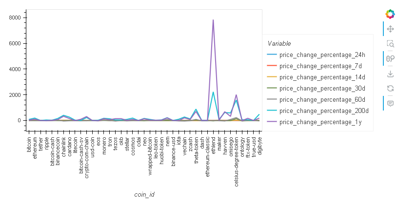
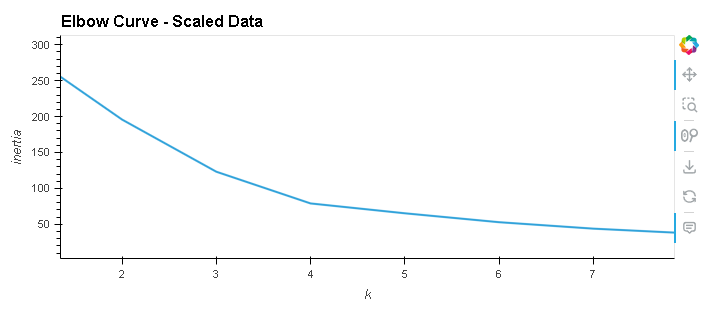
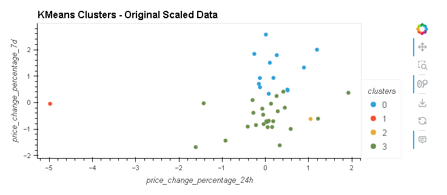
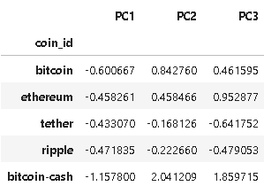
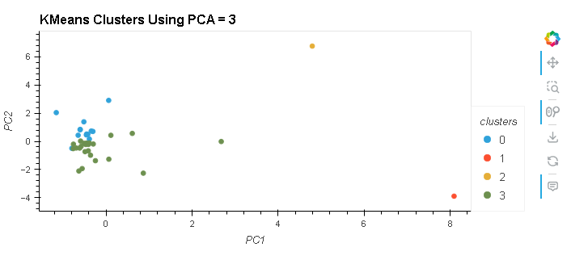
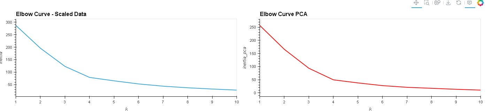
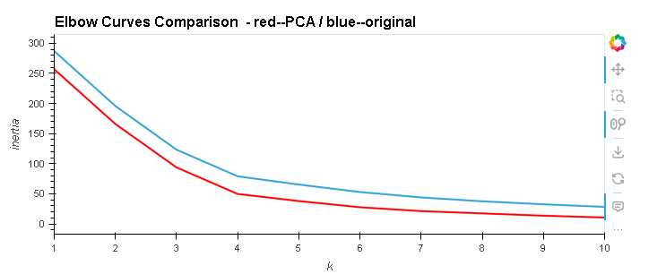

# CryptoClustering

###Data frame visualization

###Best Value for K from Original Data

###Cluster the Cryptocurrencies with K-Means using Orignal Data

###Optimize the Clusters with PCA

###Find Best Value for K Using PCA Data

###Cluster the Cryptocurrencies with K-Means Using the PCA Data

###Compare Results

